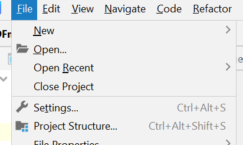
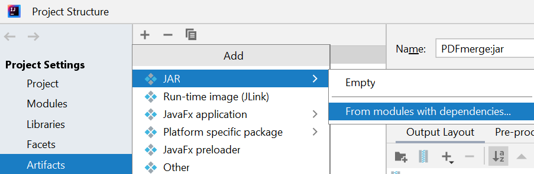
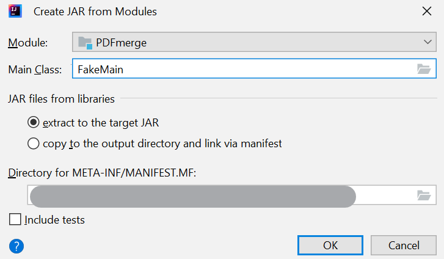
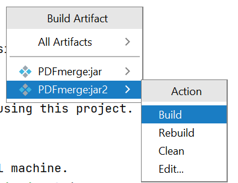

# PDF Merger

### Description
PDF Merger merges multiple PDFs into a single PDF.

### Installation pre-requirements
The latest version of JRE must be installed prior to the installation steps.

### Installation
Please see the "Releases" tab on the right for the latest production builds!

### Cloning & Building 
The following instructions are for those that would like to create the `.jar` file themselves.

#### On IntelliJ
1. Clone this repository into your local machine.
2. in `src/main/java`, make sure `FakeMain.java` is **un-commented**.
3. Under "File", click "Project Structure".

4. Under "Project Settings", click "Artifacts".
5. Hit the `+` button at the top left.
6. Select "JAR" -> "From modules with dependencies".

7. In the pop-up that appears, locate and select `FakeMain` as the main class.
8. Mark "Extract to the target JAR".
9. Hit "OK".

10. Hit "Apply", then "OK".
11. Under "Build", click "Build Artifacts".
12. Hover over the artifact you just created, and select "build".

13. An executable `.jar` file should be created in the `out` directory.
14. Right click the jar file, select Open In -> Explorer.
15. Double click the jar file to run.
